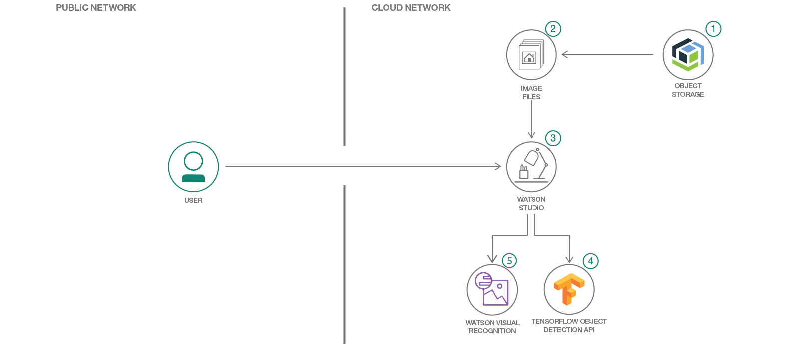
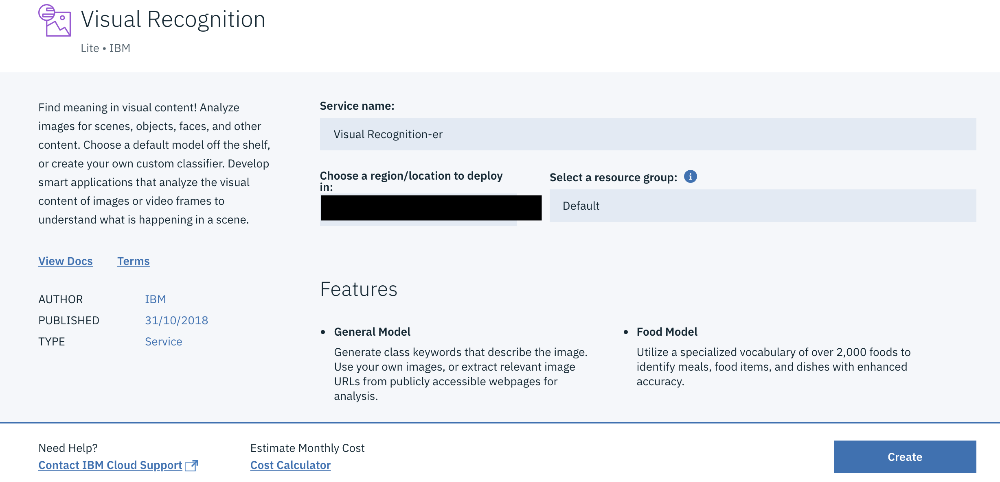
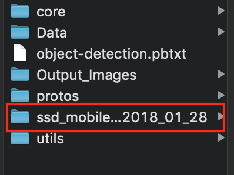
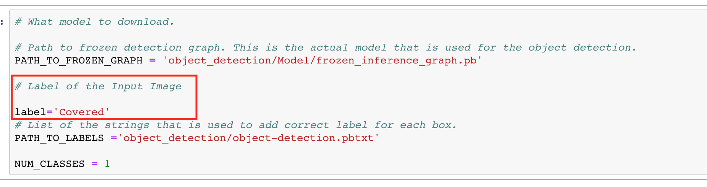
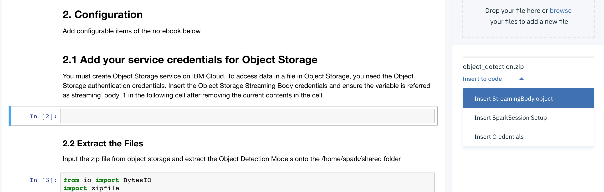
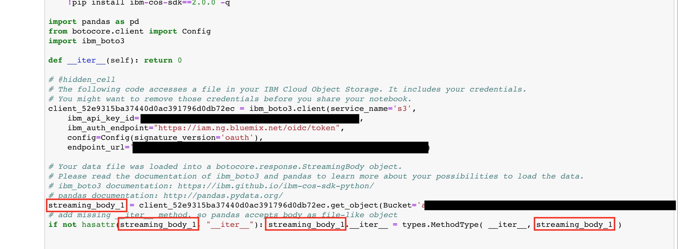
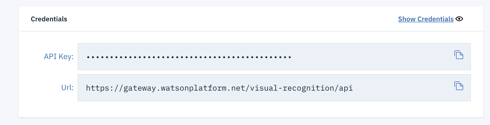
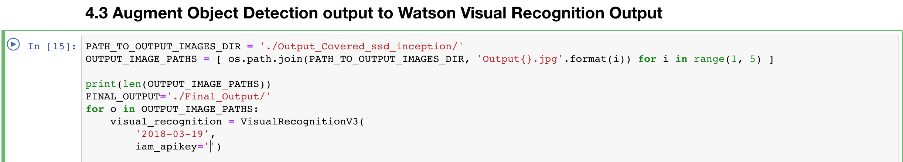
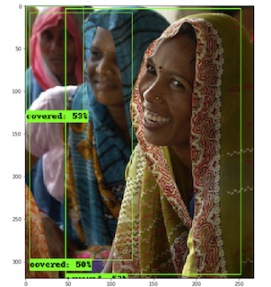
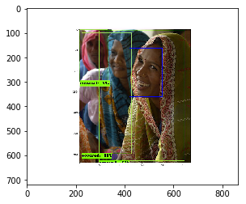

# Augment Visual Recognition Face Detection to further Identify Covered human faces

In this code pattern, we will demonstrate a methodology to extend `Watson Visual Recognition` face detection by providing a strategy that will detect the border cases such as, blur and covered faces, with `Tensorflow Object Detection`, compiled in `Watson Studio`.

When the reader has completed this code pattern, they will know how to:

* Use and understand Tensorflow Object Detection API's models.
* Understand Watson Visual Recognition's face detection.
* Understand the strategy used to overcome border cases of a Face Detection Model.
* Create and run a Jupyter notebook in Watson Studio.
* Use Object Storage to access data files.



## Flow

1. Create an Image Dataset containing faces that required to be detected, upload these images on Cloud Object Storage.
2. Next these image files are fed into the Watson Studio python notebook.
3. The algorithm first detects faces using a model of Tensorflow Object Detection API.
4. The detected faces are augmented to Watson Visual Recognition face detection output.

## Watch the Video

[](https://www.youtube.com/watch?v=w1WTRuWxR-8&t=6s)

## Steps

1. [Get the Object Detection data](#1-get-the-object-detection-data)
2. [Create Watson Visual Recognition Service](#2-create-watson-visual-recognition-service)
3. [Run using a Jupyter notebook in the IBM Watson Studio](#3-run-using-a-jupyter-notebook-in-the-ibm-watson-studio)
4. [Analyze the Results](#4-analyze-the-results)

## 1. Get the Object Detection data

* Navigate to the [object_detction.zip](https://github.com/IBM/augment-visual-recognition-detection-of-low-resolution-human-faces/blob/master/object_detection.zip) and download it.
* Unzip the file to your file system.

> **NOTE**: The contents of the object_detection folder have been obtained from the [Tensorflow Object Detection API](https://github.com/tensorflow/models/tree/master/research/object_detection) repo. Since the entire repo was not needed and only a few folders were required.

## 2. Create Watson Visual Recognition Service

Go to the [Watson Visual Recognition Service](https://cloud.ibm.com/catalog/services/visual-recognition) and click on the `Create` button.



The ``Watson Visual Recognition`` service will be added to your [IBM Cloud Dashboard](https://cloud.ibm.com/dashboard/apps).

## 3. Run using a Jupyter notebook in the IBM Watson Studio

1. [Data Preparation](#31-data-preparation)
2. [Model Preparation](#32-model-preparation)
3. [Create a notebook on Watson Studio](#33-create-a-notebook-on-watson-studio)
4. [Add Tensorflow Object Detection API files](#34-add-tensorflow-object-detection-api-files)
5. [Update notebook with service credentials](#35-update-notebook-with-service-credentials)
6. [Run the notebook](#36-run-the-notebook)

### 3.1 Data Preparation

You can use the dataset provided in the unzipped `object_detection/Data` folder or create your own dataset.

> **NOTE**: These images were obtained from Google Images with the filter: `free to use, share or modify, even commercially` applied. The original source of the images are as below:
> * [Covered1.jpg](https://en.wikipedia.org/wiki/Adivasi)
> * [Covered2.jpg](https://de.wikipedia.org/wiki/Datei:Femmes_adivasies,_Gwalior,_India.jpg)
> * [Covered3.jpg](https://ne.wikipedia.org/wiki/%E0%A4%9A%E0%A4%BF%E0%A4%A4%E0%A5%8D%E0%A4%B0:Woman_and_child_in_Raisen_district.jpg)
> * [Covered4.jpg](https://commons.wikimedia.org/wiki/File:Women_in_adivasi_village,_Umaria_district,_India.jpg)

#### Optional: To create your own dataset

Create a folder named `Data` in the created `Object_Detection` folder. Ensure the name of the image file follows the format of `label1` where label can be any label assigned to the image and the number increments for each image.
Eg: Covered1.jpg, Covered2.jpg and so on.

Update the `name` field to your desired name in the `object-detection.pbtxt` file within the unzipped `Object_Detection` folder.

```json
"item" : {
    "id": 1,
    "name": "covered"
}
```

### 3.2 Model Preparation

* Follow this link: [https://github.com/tensorflow/models/blob/master/research/object_detection/g3doc/detection_model_zoo.md](https://github.com/tensorflow/models/blob/master/research/object_detection/g3doc/detection_model_zoo.md) and download any of the COCO trained models, as per your requirement. If you are using the same dataset the preferred model would be `ssd_mobilenet_v1_coco`.
* Unzip the model folder and copy the `frozen_inference_graph.pb` file into the `object_detection/Model` folder.
* Once all components are added your `object_detection` folder would contain the following directory structure.

  

* Compress the `Object_Detection` folder so it can be uploaded to Object Storage.

> **NOTE**: If you are running OSX then compression creates some additional files which should be deleted. In a terminal, go to the compressed file location and run the following commands:
> * `zip -d Object_Detection.zip \__MACOSX/\\*`
> * `zip -d Object_Detection.zip \\\*/.DS_Store`

### 3.3 Create a notebook on Watson Studio

A [notebook](https://dataplatform.cloud.ibm.com/docs/content/analyze-data/notebooks-parent.html) in Watson Studio is a web-based environment for interactive computing. You can run small pieces of code that process your data, and you can immediately view the results of your computation.

* Log into IBM's [Watson Studio](https://dataplatform.cloud.ibm.com). Once in, you'll land on the dashboard.

* Create a new project by clicking `+ New project` and choosing `Standard`.

  

* To create a project in Watson Studio, give the project a name and select the Cloud Object Storage service created.

  

* Upon a successful project creation, you are taken to a dashboard view of your project. Take note of the `Assets` and `Settings` tabs, we'll be using them to associate our project with any external assets (datasets and notebooks) and any IBM cloud services.

  

* From the new project `Overview` panel, click `+ Add to project` on the top right and choose the `Notebook` asset type.

  

Fill in the following information:

  * Select the `From URL` tab. [1]
  * Enter a `Name` for the notebook and optionally a description. [2]
  * Under `Notebook URL` provide the following url: [https://github.com/IBM/augment-visual-recognition-detection-of-low-resolution-human-faces/blob/master/notebook/Augment_Visual_Recognition.ipynb](https://github.com/IBM/augment-visual-recognition-detection-of-low-resolution-human-faces/blob/master/notebook/Augment_Visual_Recognition.ipynb) [3]
  * For `Runtime` select the `Python 3.5` option. [4]

  

### 3.4 Add Tensorflow Object Detection API files

* Add `object_detection.zip` file, prepared at the end of [Section 3.2](#32-model-preparation), to Object Storage. From the new project `Overview` panel, click `+ Add to project` on the top right and choose the `Data` asset type.

   

* A panel on the right of the screen will appear to assit you in uploading data. Follow the numbered steps in the image below.

  * Ensure you're on the `Load` tab. [1]
  * Click on the `browse` option. From your machine, browse to the location of the [`object_detection.zip`](object_detection.zip) file in this repository, and upload it. [not numbered]
  * Once uploaded, go to the `Files` tab. [2]
  * Ensure the `object_detection.zip` appears. [3]


* If you use your own dataset, you will need to update the variables/folder names that refer to the data files in the Jupyter Notebook.
* To open the notebook, click on the edit icon to start editing the notebook on your project.
* In the notebook, update the global variables in the cell, if you had used your model/dataset.

#### Update the Global Variables section

* Update the label to the label given to your test images as per [Section 3.2](#32-model-preparation)

  

### 3.5 Update notebook with service credentials

#### Add the Object Storage credentials to the notebook

Select the cell below `2.1 Add your service credentials for Object Storage` section in the notebook to update the credentials for Object Store.

* Use `Find and Add Data` (look for the 10/01 icon) and its Files tab. You should see the file names uploaded earlier. Make sure your active cell is the empty one below 2.1 Add...
* Under Files, click the dropdown for `Insert to code` for `object_detection.zip`
* Click `Insert StreamingBody object`.



* Make sure the credentials are saved as streaming_body_1. If not edit and replace the numbers to 1. There should be four such occurrences in the cell as shown in the below image



#### Add the Visual Recognition credentials to the notebook

* Go to your [IBM Cloud Dashboard](https://cloud.ibm.com/). Select the previously created Visual Recognition instance.



* On the landing page, under the Credentials section, copy the `API key`.
* Now, in the notebook, navigating to `4.3 Augment Object Detection output to Watson Visual Recognition Output`



* In the declaration of `VisualRecognitionV3` service, paste the copied API key as value to the `iam_apikey` variable.

### 3.6 Run the notebook

When a notebook is executed, what is actually happening is that each code cell in
the notebook is executed, in order, from top to bottom.

Each code cell is selectable and is preceded by a tag in the left margin. The tag
format is `In [x]:`. Depending on the state of the notebook, the `x` can be:

* A blank, this indicates that the cell has never been executed.
* A number, this number represents the relative order this code step was executed.
* A `*`, this indicates that the cell is currently executing.

There are several ways to execute the code cells in your notebook:

* One cell at a time.
  * Select the cell, and then press the `Play` button in the toolbar.
* Batch mode, in sequential order.
  * From the `Cell` menu bar, there are several options available. For example, you
    can `Run All` cells in your notebook, or you can `Run All Below`, that will
    start executing from the first cell under the currently selected cell, and then
    continue executing all cells that follow.
* At a scheduled time.
  * Press the `Schedule` button located in the top right section of your notebook
    panel. Here you can schedule your notebook to be executed once at some future
    time, or repeatedly at your specified interval.

For this notebook, run it `one cell at a time`. Make sure to `restart` the notebook, once you run the section `1. Setup`, as specified in the notebook.

## 4. Analyze the Results

This code patterns aims to show a strategy to cover the border cases, such as a covered face.

After setting up the notebook on Watson Studio, first we get the results of Object Detection API of Tensorflow. where in we treat `Covered face` as a an object.

Next the objects detected are further augmented to `Watson Visual Recognition` Face Detection, in order to showcase an enhanced face detection model.

Thus, we achieve an increased accuracy by detecting more number of faces than a normal face detection algorithm.

### Sample output

The `green` box depicts the Object Detection and the `blue` box depicts Watson Visual Recognition's Face Detection Output.

#### Output of Tensorflow Model



#### Augmented Output of Visual Recognition



Thus, this pattern demonstrates a methodology to extend Watson Visual Recognition's face detection by providing a strategy that will detect the border cases such as, blur and covered faces.

## License

This code pattern is licensed under the Apache Software License, Version 2.  Separate third party code objects invoked within this code pattern are licensed by their respective providers pursuant to their own separate licenses. Contributions are subject to the [Developer Certificate of Origin, Version 1.1 (DCO)](https://developercertificate.org/) and the [Apache Software License, Version 2](http://www.apache.org/licenses/LICENSE-2.0.txt).

[Apache Software License (ASL) FAQ](http://www.apache.org/foundation/license-faq.html#WhatDoesItMEAN)
