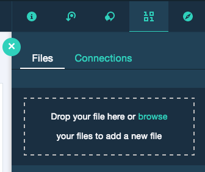

# augment-visual-recognition-detection-of-low-resolution-human-faces

Work In Progress

`Intro`

`Architecture Diagram`
## Flow

## Included components

* [Watson Visual Recognition](https://www.ibm.com/watson/services/visual-recognition/): Visual Recognition understands the contents of images - visual concepts tag the image, find human faces, approximate age and gender, and find similar images in a collection.

## Featured technologies

* [Jupyter Notebooks](http://jupyter.org/): An open-source web application that allows you to create and share documents that contain live code, equations, visualizations and explanatory text.
* [Tensorflow Object Detection API](https://github.com/tensorflow/models/tree/master/research/object_detection): The TensorFlow Object Detection API is an open source framework built on top of TensorFlow that makes it easy to construct, train and deploy object detection models.

## Video

## Prerequisite
If the below are not already installed on your system, please follow the links and install according to your system specifications-
* [Git](https://git-scm.com/downloads): To clone the repo, alternatively you could use the `Clone or Download` button.
* [IBM Cloud account](https://console.bluemix.net/registration/?target=%2Fdashboard%2Fapps): To access IBM Cloud and Watson Services.
* [IBM Cloud CLI](https://console.bluemix.net/docs/cli): To push the python application on your IBM Cloud Organization.

# Steps

1. [Sign up for IBM Watson Studio](#1-sign-up-for-ibm-watson-studio)
2. [Run using a Jupyter notebook in the IBM Watson Studio](#2-run-using-a-jupyter-notebook-in-the-ibm-watson-studio)
3. [Analyze the Results](#3-analyze-the-results)

## 1. Sign up for IBM Watson Studio

If you have not already signed up for Watson Studio then you can sign up [here](https://console.bluemix.net/catalog/services/watson-studio). By signing up for IBM Watson Studio, two services will be created - ``Spark`` and ``ObjectStore`` in your IBM Cloud account.

## 2. Run using a Jupyter notebook in the IBM Watson Studio

1. [Create a new Watson Studio project](#21-create-a-new-watson-studio-project)
2. [Create the notebook](#22-create-the-notebook)
3. [Run the notebook](#23-run-the-notebook)
4. [Upload data](#24-upload-data)
5. [Save and Share](#25-save-and-share)

### 2.1 Create a new Watson Studio project

* Log in or sign up for IBM's [Watson Studio](https://dataplatform.ibm.com).

* Select the `New Project` option from the Watson Studio landing page and choose the `Jupyter Notebooks` option.

* To create a project in Watson Studio, give the project a name and either create a new `Cloud Object Storage` service or select an existing one from your IBM Cloud account.

* Upon a successful project creation, you are taken to a dashboard view of your project. Take note of the `Assets` and `Settings` tabs, we'll be using them to associate our project with any external assets (datasets and notebooks) and any IBM cloud services.

Once the service is open, click the `Service Credentials` menu on the left.

### 2.2 Create the notebook

* From the project dashboard view, click the `Assets` tab, click the `+ New notebook` button.

* Give your notebook a name and select your desired runtime, in this case we'll be using the associated Spark runtime.

* Now select the `From URL` tab to specify the URL to the notebook in this repository.

* Click the `Create` button.

### 2.3 Run the notebook

When a notebook is executed, what is actually happening is that each code cell in
the notebook is executed, in order, from top to bottom.

Each code cell is selectable and is preceded by a tag in the left margin. The tag
format is `In [x]:`. Depending on the state of the notebook, the `x` can be:

* A blank, this indicates that the cell has never been executed.
* A number, this number represents the relative order this code step was executed.
* A `*`, this indicates that the cell is currently executing.

There are several ways to execute the code cells in your notebook:

* One cell at a time.
  * Select the cell, and then press the `Play` button in the toolbar.
* Batch mode, in sequential order.
  * From the `Cell` menu bar, there are several options available. For example, you
    can `Run All` cells in your notebook, or you can `Run All Below`, that will
    start executing from the first cell under the currently selected cell, and then
    continue executing all cells that follow.
* At a scheduled time.
  * Press the `Schedule` button located in the top right section of your notebook
    panel. Here you can schedule your notebook to be executed once at some future
    time, or repeatedly at your specified interval.

### 2.4 Upload data

#### Upload the data and configuration to the notebook

* From the `My Projects > Default` page, Use `Find and Add Data` (look for the `10/01` icon)
and its `Files` tab.
* Click `browse` and navigate to [Archive.zip](https://github.com/IBM/build-knowledge-base-with-domain-specific-documents/tree/master/data)
* Click `browse` and navigate to [config_relations.txt](https://github.com/IBM/build-knowledge-base-with-domain-specific-documents/tree/master/data)
* Click `browse` and navigate to [config_classification.txt](https://github.com/IBM/build-knowledge-base-with-domain-specific-documents/tree/master/data)

> Note:  It is possible to use your own data and configuration files.
If you use a configuration file from your computer, make sure to conform to the JSON structure given in `data/config_classification.txt`.

### 2.5 Save and Share

#### How to save your work:

Under the `File` menu, there are several ways to save your notebook:

* `Save` will simply save the current state of your notebook, without any version
  information.
* `Save Version` will save your current state of your notebook with a version tag
  that contains a date and time stamp. Up to 10 versions of your notebook can be
  saved, each one retrievable by selecting the `Revert To Version` menu item.

#### How to share your work:

You can share your notebook by selecting the “Share” button located in the top
right section of your notebook panel. The end result of this action will be a URL
link that will display a “read-only” version of your notebook. You have several
options to specify exactly what you want shared from your notebook:

* `Only text and output`: will remove all code cells from the notebook view.
* `All content excluding sensitive code cells`:  will remove any code cells
  that contain a *sensitive* tag. For example, `# @hidden_cell` is used to protect
  your dashDB credentials from being shared.
* `All content, including code`: displays the notebook as is.
* A variety of `download as` options are also available in the menu.

## 3. Analyze the results

# Troubleshooting

[See DEBUGGING.md.](DEBUGGING.md)

# License

[Apache 2.0](LICENSE)
